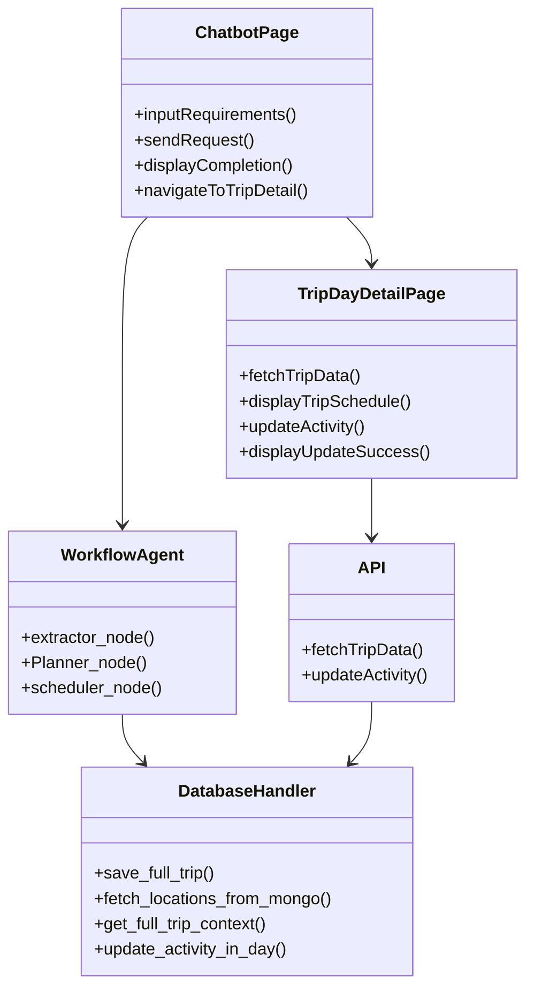
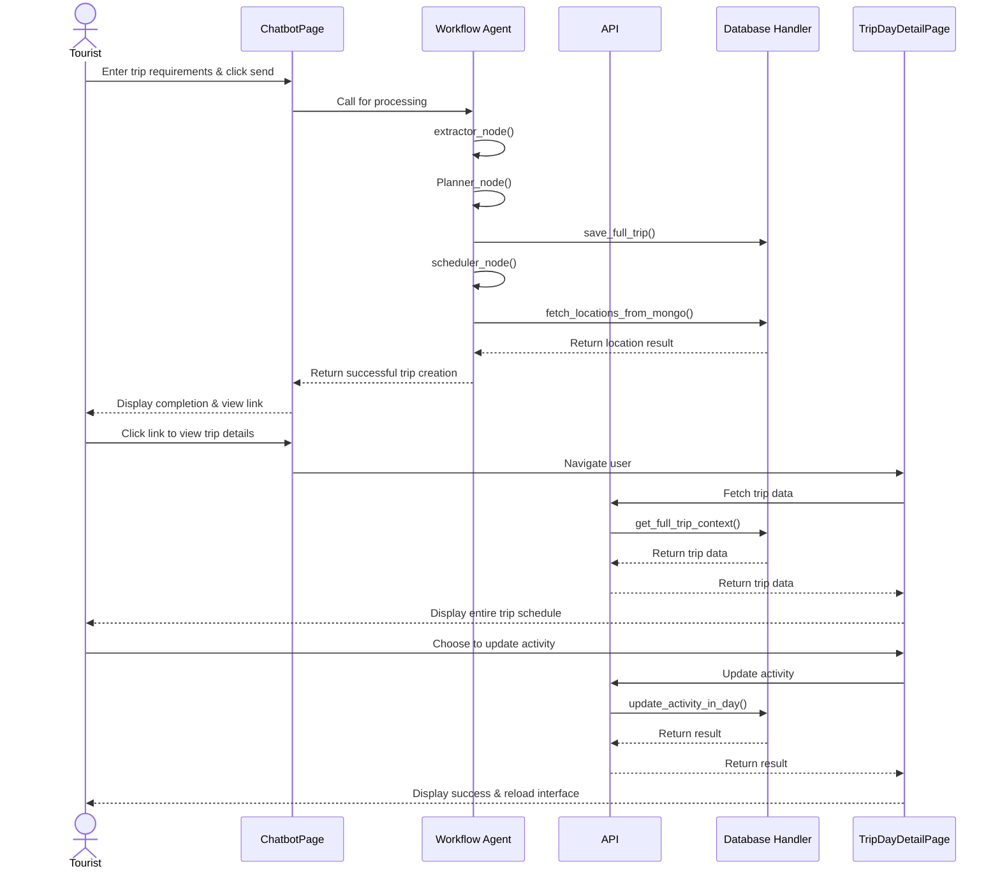
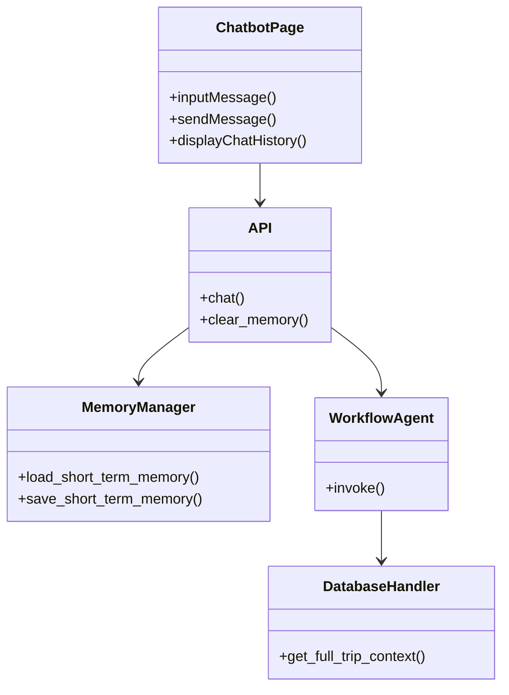
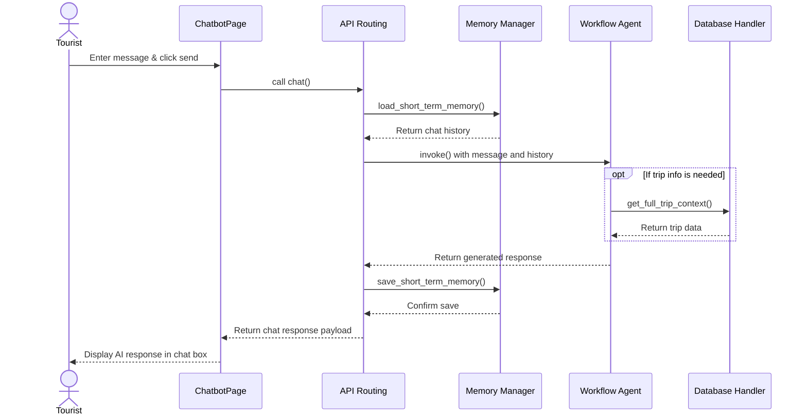
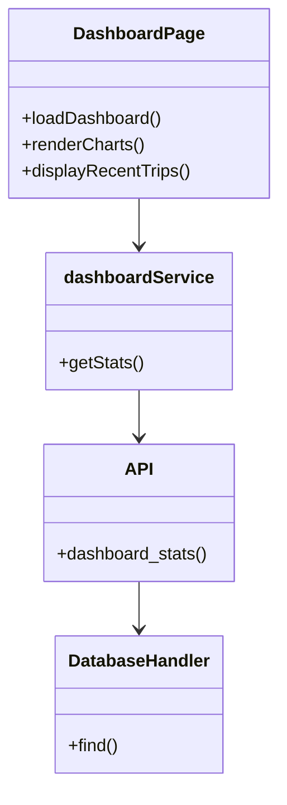
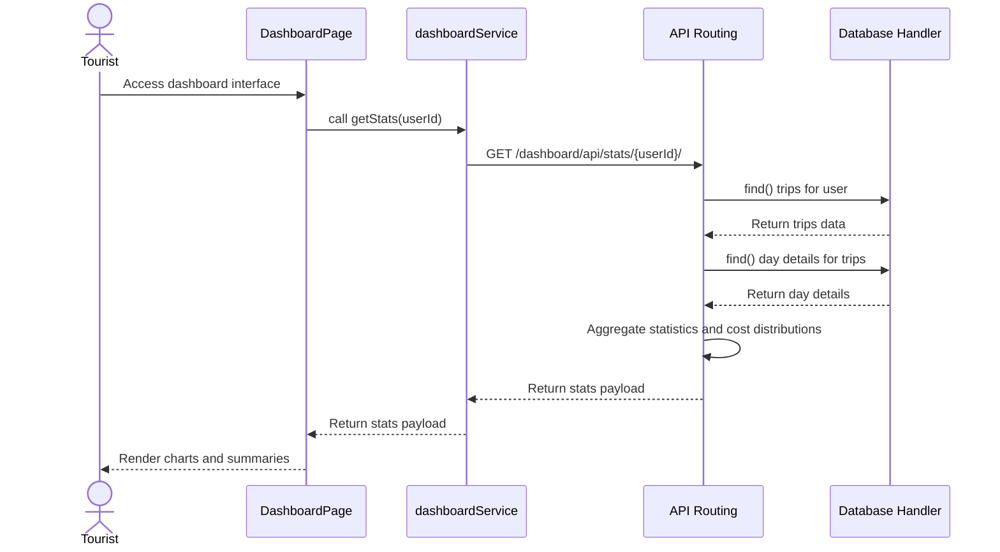
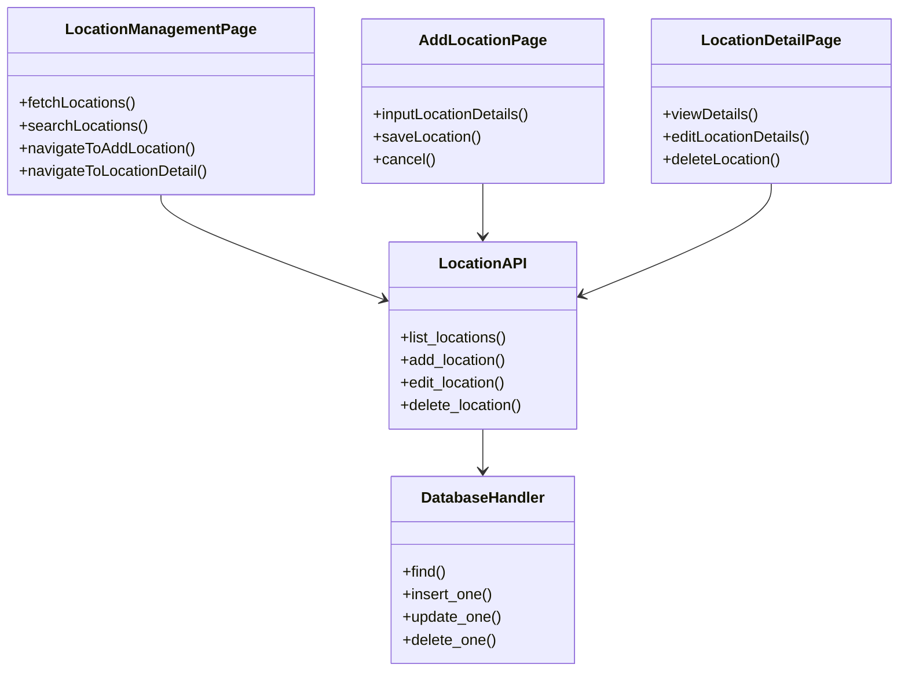
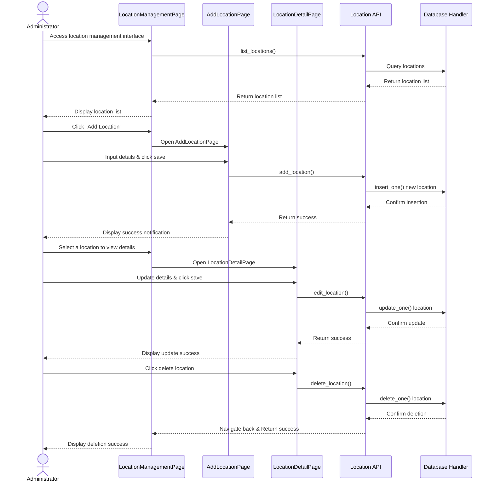

\chapter{Analysis}

\section{Description}
The Traplanner system manages real-world travel locations, itineraries, user preferences, and chatbot interactions. The system allows administrators to manage and update geospatial data such as tourist destinations, accommodations, and restaurants. Users log into the system to interact with trip planner, which generates personalized travel schedules based on their constraints (budget, time, ...). Users can view their generated itineraries (trip) in detail, they can also replace detail of the itinerary. During the generation process, the system creates trips, assigns consecutive Day Details, and schedules multiple Activities that are linked to specific Locations. The system also leverages a knowledge graph consisting of provinces and wards to optimize geographical routing and proximity. Finally, the system allows users to manage their personal travel history via a dashboard, while administrators can monitor system-wide statistics.

\subsection{Nouns Extraction}
\begin{itemize}
    \item System, information, preferences, results, lists, statistics, constraints: General nouns $\rightarrow$ Types.
    \item User: Represents the individual account logging into the system $\rightarrow$ Entity class: \textbf{User}.
    \item Administrator: The user responsible for managing the system's geospatial data and monitoring statistics $\rightarrow$ Entity class: \textbf{Administrator} (inherits from User).
    \item Tourist: The primary end-user interacting with the chatbot to plan trips $\rightarrow$ Entity class: \textbf{Tourist} (inherits from User).
    \item Location: The physical place (Accommodation, Restaurant, Attraction) managed in the database $\rightarrow$ Entity class: \textbf{Location}.
    \item Trip: The main travel plan entity generated for the user $\rightarrow$ Entity class: \textbf{Trip}.
    \item Day Detail: A specific day's schedule within a multi-day trip $\rightarrow$ Entity class: \textbf{DayDetail}.
    \item Activity: A specific event or action scheduled within a Day Detail, linked to a Location $\rightarrow$ Entity class: \textbf{Activity}.
    \item Province: A high-level geospatial administrative node $\rightarrow$ Entity class: \textbf{Province}.
    \item Ward: A lower-level geospatial node belonging to a Province $\rightarrow$ Entity class: \textbf{Ward}.
    \item Transportation: The record of travel mode and duration between cities $\rightarrow$ Entity class: \textbf{Transportation}.
    \item Chat Memory: The recorded context and conversation history of a user's chatbot session $\rightarrow$ Entity class: \textbf{ChatMemory}.
    \item User ID, Username, Description, Estimated Price, Start Time, End Time: Abstract details $\rightarrow$ Types 
\end{itemize}
\textbf{Final list of entity classes:} User, Administrator, Tourist, Location, Trip, DayDetail, Activity, Province, Ward, Transportation, ChatMemory.

\subsection{Detailed Analysis of User Generate Trip Module}

The user (Tourist) accesses the system, proposing the \textbf{ChatbotPage} component to allow users to input trip requirements (budget constraints, time constraints, etc.) into the chat box. After entering the information and clicking send, the system receives and analyzes the request $\rightarrow$ requiring the \textbf{extractor\_node()} function $\rightarrow$ This function belongs to the \textbf{Workflow Agent}.
After analyzing the request, the system initializes the trip $\rightarrow$ requiring the \textbf{save\_full\_trip()} function $\rightarrow$ This function belongs to the \textbf{Database Handler}.
To plan each day of the trip, the system generates detailed schedules and activities $\rightarrow$ requiring the \textbf{scheduler\_node()} function $\rightarrow$ This function belongs to the \textbf{Workflow Agent}.
During activity creation, the system searches for suitable locations (accommodations, restaurants, attractions) based on the knowledge graph $\rightarrow$ requiring the \textbf{fetch\_locations\_from\_mongo()} function $\rightarrow$ This function belongs to the \textbf{Location} handler.
Once the AI has completed the schedule, the system sends a success notification. The user clicks to view trip details, proposing the \textbf{TripDayDetailPage} component to display trip information, including a list of days and detailed activities for each day. To display this information, the system requires the \textbf{get\_full\_trip\_context()} function $\rightarrow$ This function belongs to the \textbf{Database Handler}.
The user on \textbf{TripDayDetailPage} can then request to change/update an activity $\rightarrow$ requiring the \textbf{update\_activity\_in\_day()} function $\rightarrow$ This function belongs to the \textbf{Database Handler}.

\textbf{Functional Analysis Class Diagram}

\textbf{Functional Analysis Sequence Diagram}

The user enters trip requirements into the ChatbotPage and clicks the send button
The ChatbotPage calls the Workflow Agent for processing
The Workflow Agent calls the extractor\_node() function. The result is successful
The Workflow Agent calls the Planner\_node() to plan the trip
The Workflow Agent calls the save\_full\_trip() function to save the new trip, days, and activities
The Workflow Agent calls the scheduler\_node() to format daily schedules and activities
The scheduler\_node() calls fetch\_locations\_from\_mongo() to get location information (accommodations, restaurants, attractions)
The database returns the location result to the Workflow Agent
The Workflow Agent returns the successful trip creation result to the ChatbotPage
The ChatbotPage displays a completion response and a link to view the trip for the user
The user clicks the link to view the trip details
The ChatbotPage navigates the user to the TripDayDetailPage
The TripDayDetailPage calls the API to fetch trip data
The API calls the get\_full\_trip\_context() function
The get\_full\_trip\_context() function returns the trip data to the TripDayDetailPage
The TripDayDetailPage displays the entire trip schedule to the user
The user chooses to update an activity on the trip
The TripDayDetailPage calls the API to update the activity
The API calls the update\_activity\_in\_day() function
The update\_activity\_in\_day() function returns the result to the TripDayDetailPage
The TripDayDetailPage displays a successful update notification and reloads the interface

\subsection{Detailed Analysis of User using chatbot Module}

The user (Tourist) accesses the system, proposing the \textbf{ChatbotPage} component to provide a chat interface. After entering a message and clicking send, the system receives the request $\rightarrow$ requiring the \textbf{chat()} function $\rightarrow$ This function belongs to the \textbf{API Routing} handler.
Before processing the new message, the system retrieves the user's previous conversation history $\rightarrow$ requiring the \textbf{load\_short\_term\_memory()} function $\rightarrow$ This function belongs to the \textbf{Memory Manager}.
The system then passes the user's message and the conversation context to the AI agent to analyze intent and generate a response $\rightarrow$ requiring the \textbf{invoke()} function $\rightarrow$ This function belongs to the \textbf{Workflow Agent}.
During the response generation, if the user asks about an existing trip, the system may fetch their trip details $\rightarrow$ requiring the \textbf{get\_full\_trip\_context()} function $\rightarrow$ This function belongs to the \textbf{Database Handler}.
Once the AI returns a generated response, the system stores both the user's message and the AI's response to maintain context $\rightarrow$ requiring the \textbf{save\_short\_term\_memory()} function $\rightarrow$ This function belongs to the \textbf{Memory Manager}.
Finally, the system returns the response payload back to the \textbf{ChatbotPage}, which then updates the UI to display the conversation to the user.

\textbf{Functional Analysis Class Diagram}

\textbf{Functional Analysis Sequence Diagram}

The user enters a message into the ChatbotPage and clicks the send button
The ChatbotPage calls the API Routing for processing
The API Routing calls the load\_short\_term\_memory() function to retrieve chat history
The Memory Manager returns the chat history to the API Routing
The API Routing calls the invoke() function on the Workflow Agent with the message and history
The Workflow Agent analyzes the intent and determines if database context is needed
The Workflow Agent calls the get\_full\_trip\_context() function if applicable
The Database Handler returns the trip data to the Workflow Agent
The Workflow Agent generates and returns the final response to the API Routing
The API Routing calls the save\_short\_term\_memory() function to persist the new conversation turn
The Memory Manager saves the data and confirms with the API Routing
The API Routing returns the final chat response payload back to the ChatbotPage
The ChatbotPage displays the AI's response to the user

\subsection{Detailed Analysis of User views trip statistics Module}

The user (Tourist) accesses the system, proposing the \textbf{DashboardPage} component to view their personal travel history and statistics. Upon loading the page, the system needs to fetch the user's aggregated data $\rightarrow$ requiring the \textbf{getStats()} function $\rightarrow$ This function belongs to the \textbf{dashboardService} handler.
The frontend service then calls the backend API $\rightarrow$ requiring the \textbf{dashboard\_stats()} function $\rightarrow$ This function belongs to the \textbf{API Routing} handler.
To aggregate the statistics, the system retrieves all trips and day details associated with the user from the database $\rightarrow$ requiring the \textbf{find()} function $\rightarrow$ This function belongs to the \textbf{Database Handler}.
The system calculates statistics such as total trips, budget trends, and month-by-month activity distributions. If the user lacks history, the system retrieves and displays fallback demo trips.
After calculating the statistics and cost distributions, the system returns the JSON payload back to the \textbf{DashboardPage}, which then renders the charts, summaries, and recent trip list for the user.

\textbf{Functional Analysis Class Diagram}

\textbf{Functional Analysis Sequence Diagram}

The user accesses the dashboard interface
The DashboardPage calls the dashboardService to fetch statistics
The dashboardService calls the GET API endpoint
The API Routing calls the dashboard\_stats() function to process the request
The API Routing calls the find() function on the Database Handler
The Database Handler queries MongoDB and returns the user's trips
The API Routing queries for DayDetails to calculate cost distribution
The Database Handler returns the DayDetails to the API Routing
The API Routing aggregates the statistics, including a fallback for new users
The API Routing returns the aggregated stats payload to the dashboardService
The dashboardService passes the data back to the DashboardPage
The DashboardPage renders the charts and displays the information to the user

\subsection{Detailed Analysis of User manages locations and activities Module}

The system Administrator accesses the system and proposes the \textbf{LocationManagementPage} component to view and manage all geospatial data. Upon accessing the page, the system automatically fetches the list of locations $\rightarrow$ requiring the \textbf{list\_locations()} function $\rightarrow$ This function belongs to the \textbf{Location API} handler.
The Administrator can search for specific locations using keywords, which triggers a filtered search $\rightarrow$ requiring the \textbf{list\_locations()} function (with query parameters) $\rightarrow$ This function belongs to the \textbf{Location API} handler.
If the Administrator wants to add a new location, they click the "Add Location" button, proposing the \textbf{AddLocationPage} component. After filling in the details (name, address, category) and clicking save, the system processes the addition $\rightarrow$ requiring the \textbf{add\_location()} function $\rightarrow$ This function belongs to the \textbf{Location API} handler.
When the Administrator selects a specific location from the list, the system proposes the \textbf{LocationDetailPage} component. This interface allows the Administrator to view full details, update information, or remove the location entirely.
If the Administrator updates the location details $\rightarrow$ the system requires the \textbf{edit\_location()} function $\rightarrow$ This function belongs to the \textbf{Location API} handler.
If the Administrator chooses to delete the location $\rightarrow$ the system requires the \textbf{delete\_location()} function $\rightarrow$ This function belongs to the \textbf{Location API} handler.
All of these operations strictly require Administrator privileges to execute.

\textbf{Functional Analysis Class Diagram}

\textbf{Functional Analysis Sequence Diagram}

The Administrator accesses the location management interface
The LocationManagementPage calls the Location API to fetch the list of locations
The Location API calls the database handler to query locations
The Database Handler returns the location list to the Location API
The Location API returns the list to the LocationManagementPage
The LocationManagementPage displays the location list to the Administrator
The Administrator clicks the "Add Location" button
The LocationManagementPage opens the AddLocationPage
The Administrator inputs location details and clicks save
The AddLocationPage calls the add\_location() function on the Location API
The Location API inserts the new location into the database
The Database Handler confirms the insertion
The Location API returns a success message to the AddLocationPage
The AddLocationPage displays a success notification to the Administrator
The Administrator selects a location from the list to view its details
The LocationManagementPage opens the LocationDetailPage
The Administrator updates the location information and clicks save
The LocationDetailPage calls the edit\_location() function on the Location API
The Location API updates the location in the database
The Database Handler confirms the update
The Location API returns a success message to the LocationDetailPage
The LocationDetailPage displays a successful update notification
The Administrator chooses to delete the location
The LocationDetailPage calls the delete\_location() function on the Location API
The Location API deletes the location from the database
The Database Handler confirms the deletion
The Location API navigates the user back and returns a success message
The LocationManagementPage displays a successful deletion notification
